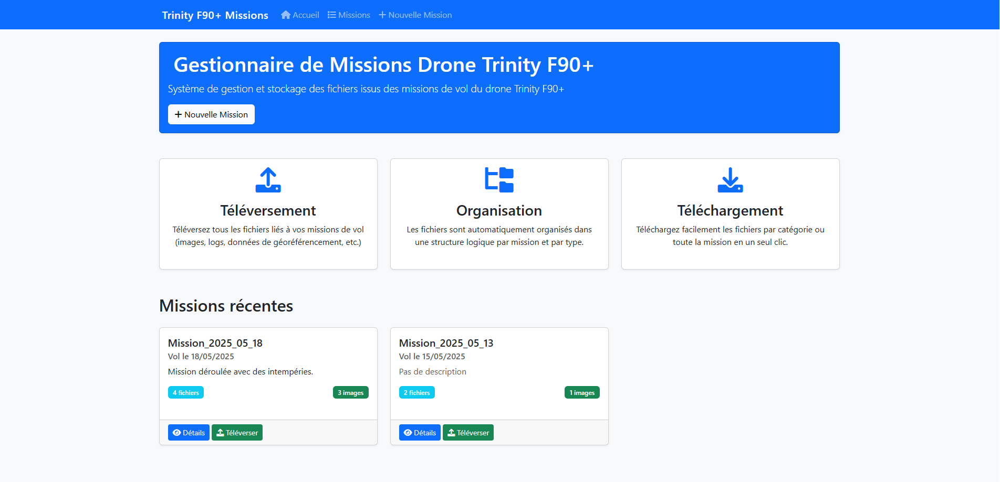

# Drone Mission Manager



## 📋 Description

Drone Mission Manager est une application web conçue pour gérer efficacement les missions de drones. Elle permet de planifier, suivre et gérer les missions de drones de manière centralisée.

## 🚀 Fonctionnalités

- Interface web intuitive pour la gestion des missions
- Stockage sécurisé des données de mission dans PostgreSQL
- Gestion des fichiers de mission
- Support Docker pour un déploiement facile
- API RESTful pour l'intégration avec d'autres systèmes

## 🛠 Technologies Utilisées

- **Backend:** Python 3.x avec Flask 2.3.3
- **Base de données:** PostgreSQL 14 (via SQLAlchemy)
- **Conteneurisation:** Docker & Docker Compose
- **Autres outils:**
  - Flask-SQLAlchemy pour l'ORM
  - Flask-Migrate pour les migrations de base de données
  - Gunicorn comme serveur WSGI
  - Pillow pour le traitement d'images

## 📦 Installation

### Prérequis

- Docker et Docker Compose
- Python 3.x (pour le développement local)
- Git

### Installation avec Docker

1. Clonez le dépôt :
```bash
git clone [URL_du_repo]
cd drone-mission-manager
```

2. Lancez l'application avec Docker Compose :
```bash
docker-compose up --build
```

L'application sera accessible à l'adresse : http://localhost:5000

### Installation locale (Développement)

1. Créez un environnement virtuel :
```bash
python -m venv venv
source venv/bin/activate  # Linux/Mac
# ou
venv\Scripts\activate  # Windows
```

2. Installez les dépendances :
```bash
pip install -r requirements.txt
```

3. Configurez les variables d'environnement :
```bash
export FLASK_APP=run.py
export FLASK_ENV=development
```

4. Lancez l'application :
```bash
flask run
```

## 🔧 Configuration

Les principales variables d'environnement sont :

- `FLASK_APP` : Point d'entrée de l'application
- `FLASK_ENV` : Environnement (development/production)
- `DATABASE_URL` : URL de connexion à la base de données
- `SECRET_KEY` : Clé secrète pour la sécurité de l'application
- `UPLOAD_FOLDER` : Dossier pour le stockage des fichiers de mission

## 📚 Documentation

Pour plus d'informations sur l'utilisation et le développement, consultez le dossier `docs/` du projet.

## 🤝 Contribution

Les contributions sont les bienvenues ! N'hésitez pas à :

1. Fork le projet
2. Créer une branche pour votre fonctionnalité
3. Commiter vos changements
4. Pousser vers la branche
5. Ouvrir une Pull Request

## 📄 Licence

Ce projet est sous licence MIT - voir le fichier [LICENSE](LICENSE) pour plus de détails.

## 📞 Support

Pour toute question ou problème, veuillez ouvrir une issue dans le gestionnaire d'issues du projet.
